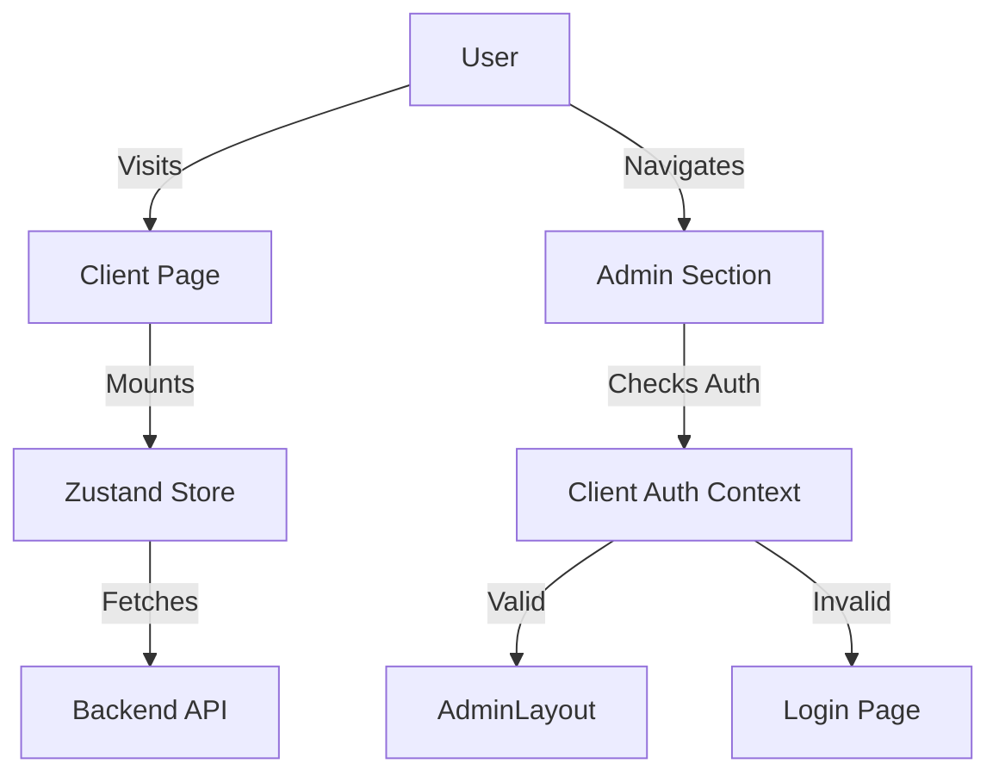

# Architecture Analysis Report

## 1. Next.js Structure Overview
### App Router Implementation
- **Route Organization**: The project uses the Next.js 14 App Router (`src/app`) effectively, with clear separation between `admin`, `survey`, and `results` flows.
- **Server/Client Components Distribution**:
    -   **Heavy Client Usage**: A significant portion of the application runs as Request-Time Client Components. Correctly, `page.tsx` often includes `'use client'`, effectively making the route client-side.
    -   **Admin Layout**: `src/app/admin/layout.tsx` is a Client Component. This wraps all admin routes in a client context. While Next.js allows Server Components as children, the layout itself contains significant client-side auth logic (`useAdminAuth`), which is a valid pattern for strict client-side auth requirements but reduces the benefits of Server Components for the admin section.
- **Metadata Strategy**: `src/app/layout.tsx` defines static metadata. Dynamic metadata generation is not heavily utilized in the files observed.

### Routing Analysis
| Route | Type | Data Fetching | Status | Loading State | Error Handling | Evaluation |
|-------|------|---------------|--------|---------------|----------------|------------|
| `/` (Landing) | Client | Client-side (Store) | ⚠️ | Custom Text | Custom Text | **C+** (Could be static/server) |
| `/survey/[dimId]` | Client | Client-side (Store) | ⚠️ | Custom UI | None observed | **B-** |
| `/results` | Client | Client-side (API) | ⚠️ | Custom UI | Error Banner | **B** |
| `/admin/dashboard` | Client | Client-side (Effect) | ⚠️ | Skeleton | Error Banner | **B** |

**Observation**: The application relies heavily on **Client-Side Data Fetching**. While `zustand` is used for state, initial data loads often happen in `useEffect`. Moving initial data fetching to Server Components (where possible, especially for Admin Dashboard stats) would improve First Contentful Paint (FCP) and Time to Interactive (TTI).

## 2. Component Architecture
### Component Classification
- **Container Components**: `AdminDashboardPage`, `ResultsClient`, `DimensionContent`. These handle logic, state, and fetching.
- **Presentational Components**: `StatCard`, `ActivityFeed`, `MaturityRadar`, `TopicCard`. These are generally well-separated, receiving data via props.

### Component Quality Matrix
| Component | LOC | Complexity | Props | Hooks | Re-renders | Grade | Issues |
|-----------|-----|------------|-------|-------|------------|-------|--------|
| `DimensionContent` | ~167 | Medium | 1 | 3 | High | **C** | Renders on every param change/store update. |
| `ResultsClient` | ~273 | High | 0 | 5* | Low | **B-** | Heavy computation in useMemo; complex state. |
| `MaturityRadar` | ~147 | Medium | 2 | 0 | Medium | **C** | Recalculates geometry on every render; Inaccessible SVG. |
| `TopicCard` | ~114 | Medium | 2 | 2 | Low | **A-** | Good separation, debounced save, memoized prompt parsing. |

### Component Issues & Recommendations
#### 🟡 Improvements Needed
1.  **Extract Logic from `ResultsClient`**: The narrative generation logic inside `useMemo` (lines 119-168) is complex and mixes store state with prop data. Extract this to a custom hook `useResultNarrative` or a pure utility function.
2.  **Server Components for Dashboard**: `AdminDashboardPage` fetches data on mount. This could be converted to a Server Component that fetches data and passes it to a client component for the interactive parts (charts/feed).

## 3. File Structure Evaluation
### Current Structure Analysis
The structure is logical and feature-based:
```
src/
├─ app/                 # Routes
├─ components/
│  ├─ admin/           # Admin-specific
│  ├─ survey/          # Survey-specific
│  ├─ results/         # Results-specific
├─ lib/
│  ├─ api/             # API clients
│  ├─ store/           # Zustand stores
```
**Rating**: **A**. The co-location of feature-specific components (`components/admin`) mirrors the route structure (`app/admin`), which is excellent for maintainability.

### Recommended Structure Refinements
-   **Middleware**: Create `src/middleware.ts` to handle Authentication at the edge. Currently, auth is checked in `AdminLayout` (Client-side), which causes a flash of content or delayed redirect. Moving this to Middleware would secure routes before they stream to the client.

## 4. State Management Deep Dive
### Zustand Store (`readiness.store.ts`)
-   **Structure**: The store is monolithic (`ReadinessState` covers API, Participant, Responses, UI State).
-   **Persistence**: Uses `persist` middleware, which is good for survey continuity.
-   **Optimistic Updates**: Implemented correctly in `submitAnswer`.
-   **Issues**:
    -   **Size**: The store is becoming large. Consider slicing it (e.g., `createResponseSlice`, `createUISlice`).
    -   **Direct API Coupling**: The store contains API fetching logic. While convenient, it makes the store harder to unit test. Consider moving async actions to a separate service layer or using React Query for server state.

## 5. Architecture Recommendations
### Short-term (1-2 weeks)
-   [ ] **Create Middleware**: Implement `middleware.ts` for Admin Route protection.
-   [ ] **Refactor `ResultsClient`**: Extract narrative generation logic to `lib/narrative/hooks.ts`.

### Medium-term (1-2 months)
-   [ ] **Server Components Migration**: Convert `AdminDashboardPage` to a Server Component to fetch initial stats on the server.
-   [ ] **Store Slicing**: Split `readiness.store.ts` into multiple slices for better maintainability.

## 6. System Diagram (Current Flow)

